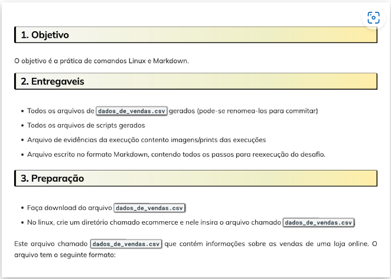

## Instruções do desafio
 
 

## Etapas

## Screenshots
[1 - Preparação](./screenshots/1-preparacao.png)  
[2 - Executando comandos](./screenshots/2-executando-comandos.png)  
[3 - Mudando permissão](./screenshots/3-mudando-permissao.png)  
[4 - Executando script](./screenshots/4-executando-script.png)  

