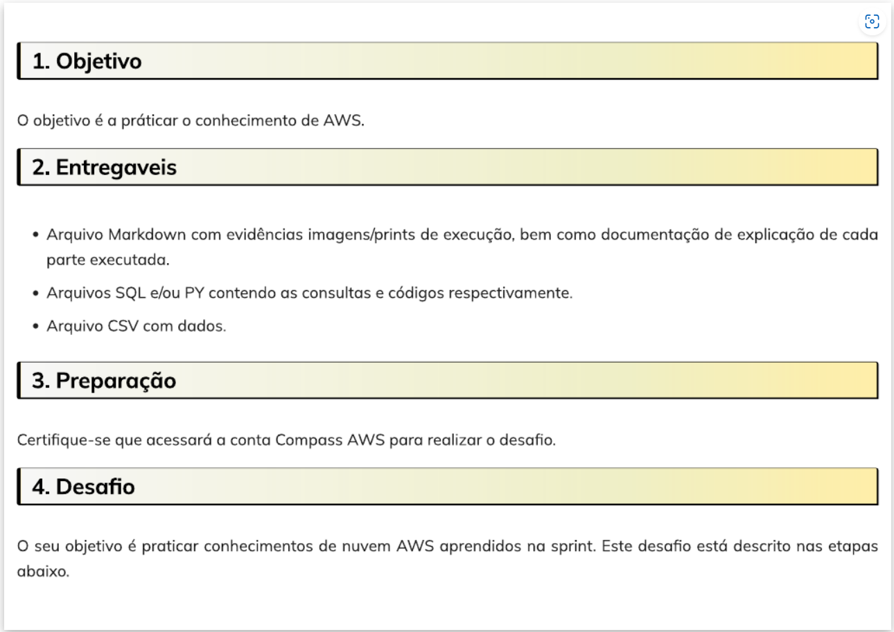
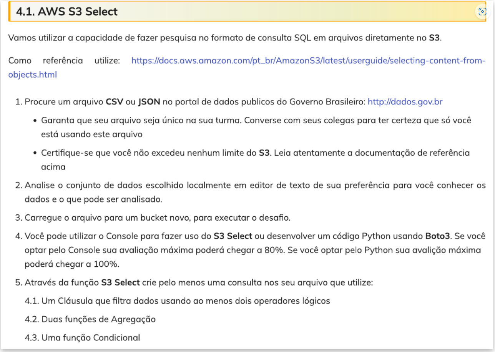
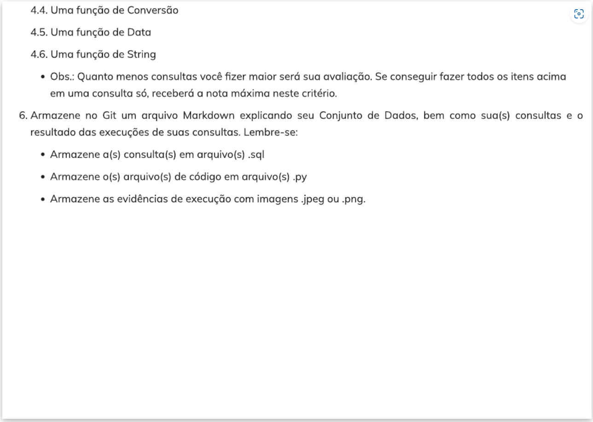
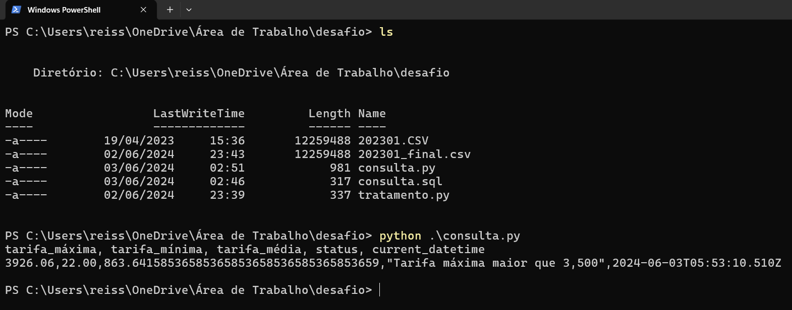

# Instruções
 
  
# Explicando dataset e query
* O [dataset utilizado](https://dados.gov.br/dados/conjuntos-dados/voos-e-operaes-areas---tarifas-areas-domsticas) são os dados das tarifas de transporte aéreo dos passageiros domésticos no ano de 2023, tendo o mês de janeiro como referência;
* Os atributos contidos no dataset são: **ANO** (2023), **MES** (1), **EMPRESA** (sigla companhia aérea), **ORIGEM** (código ICAO do aeroporto de origem), **DESTINO** (código ICAO do aeroporto de destino), **TARIFA** (valor da passagem) e **ASSENTOS** (quantidade assentos);
* A query utilizada no desafio tem como propósito retornar a maior, a menor e a média do preço das tarifas nas viagens no aeroporto de Congonhas (código SBSP) com destino ao aeroporto Santos Dummont (código SBRJ). A query também retorna uma string caso o valor máximo da tarifa seja maior que R$ 3500,00, assim como a data e o horário da consulta;
* A query atende aos seguintes requisitos do desafio (em uma consulta):
    1. Filtra dados usando ao menos dois operadores lógicos em:
    ```SQL
    WHERE ORIGEM in (upper('sbsp')) and DESTINO in (upper('sbrj'))"
    ```
    2. Usa duas funções de agregação em:
    ```SQL
    SELECT 
    max(cast(TARIFA as decimal)), 
    min(cast(TARIFA as decimal)),
    ```
    3. Usa uma função condicional em:
    ```SQL
    CASE
        WHEN max(cast(TARIFA as decimal)) > 3500 THEN       'Tarifa máxima maior que 3,500'
    END,
    ```
    4. Uma função de conversão em:
     ```SQL
    SELECT 
    avg(cast(TARIFA as decimal)), 
    ```
    5. Uma função de data em:
     ```SQL
    UTCNOW()
    ```
    6. Uma função de string em:
    ```SQL
    (upper('sbsp')) and DESTINO in (upper('sbrj'))
    ```
## Query final
```SQL
SELECT 
    max(cast(TARIFA as decimal)), 
    min(cast(TARIFA as decimal)),
    avg(cast(TARIFA as decimal)),
    CASE
        WHEN max(cast(TARIFA as decimal)) > 3500 THEN 'Tarifa máxima maior que 3,500'
    END,
    UTCNOW()
FROM s3object s
WHERE ORIGEM in (upper('sbsp')) and DESTINO in (upper('sbrj'))"
```
## Resultado

