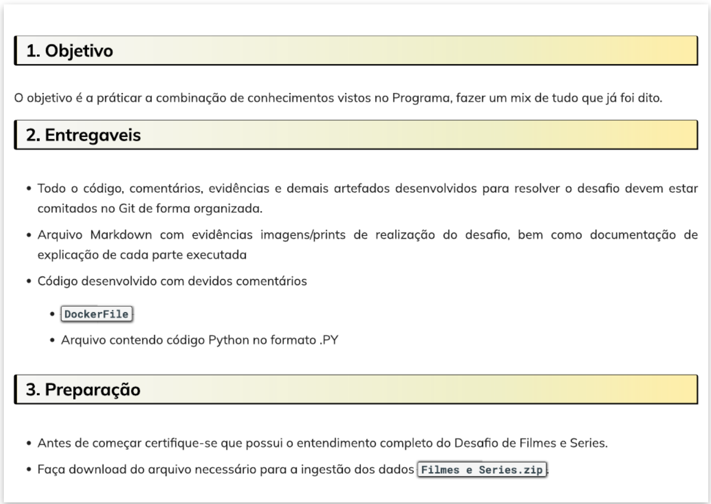
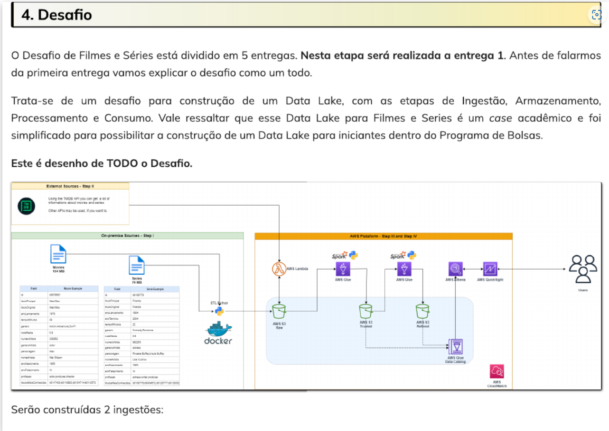
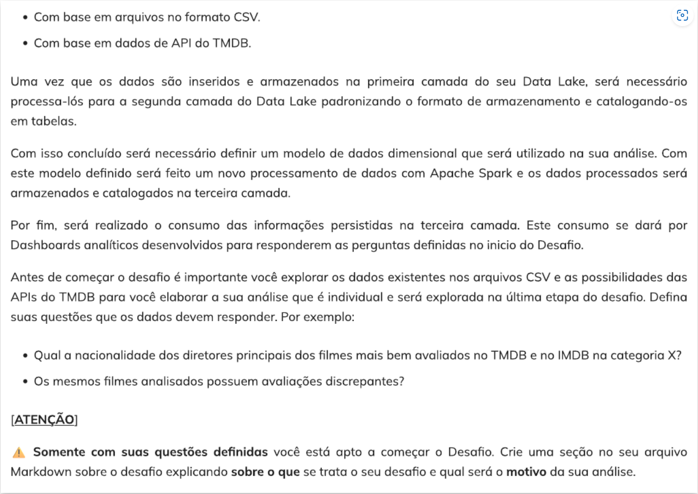
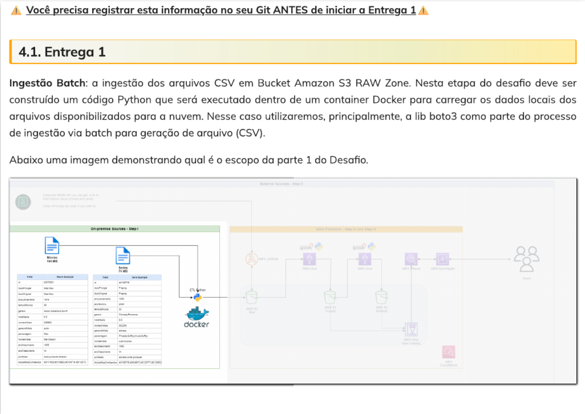
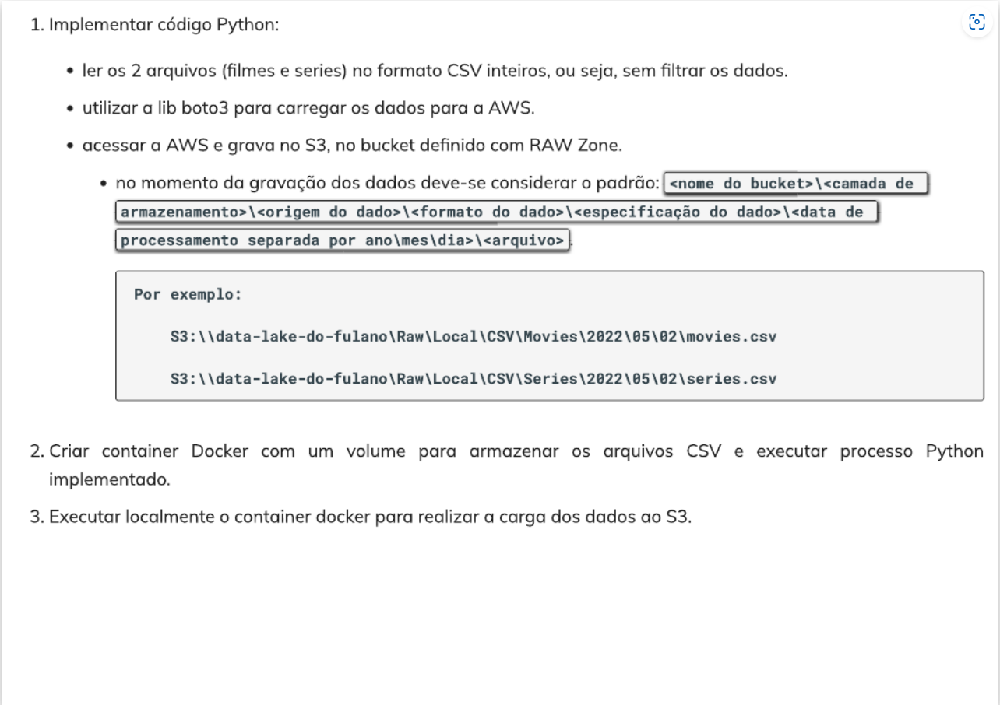
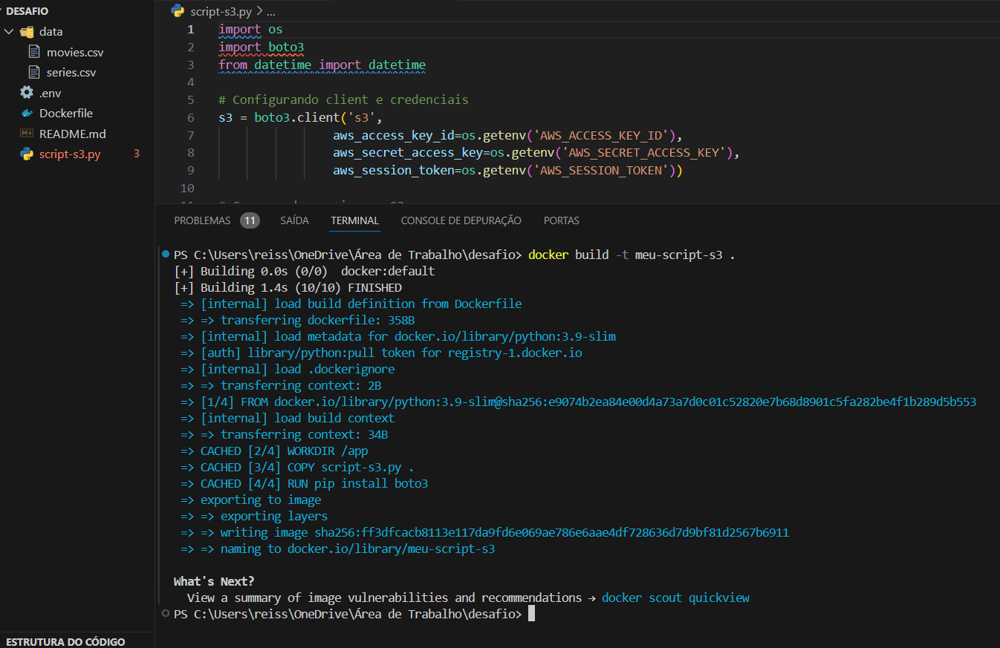
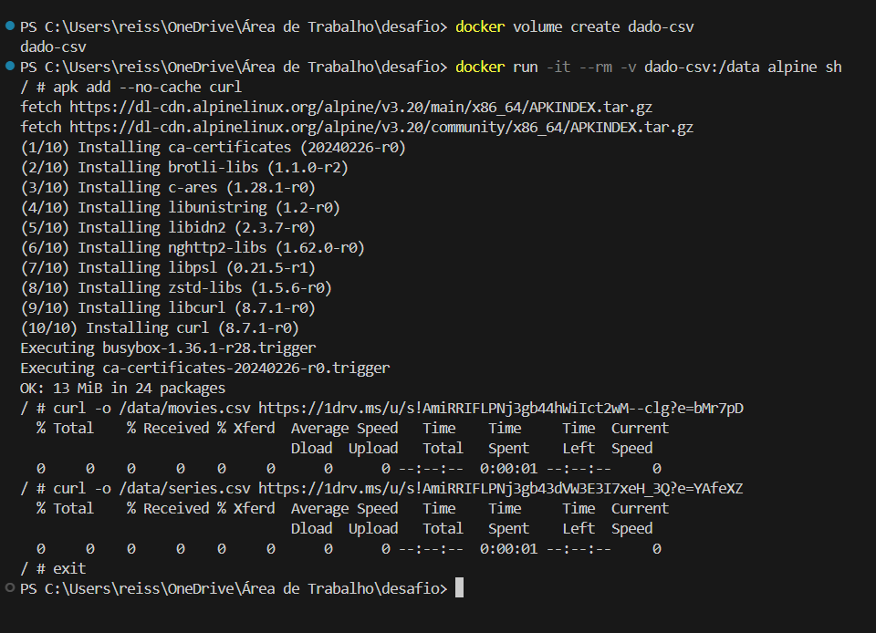
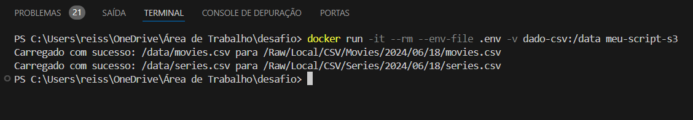
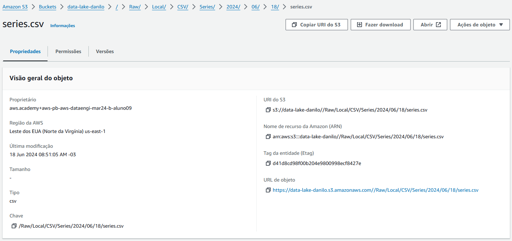

# Desafio de Filmes e Séries - Entrega 1
## Instruções  
 
 
  

## Sobre o que se trata:  
O tema do meu desafio trata de filmes e séries do gênero sci-fi/fantasia. Traçando uma linha do tempo e identificando alguns padrões, o motivo da minha análise é buscar as respostas para algumas questões como:  

* Quais são os filmes/séries de sci-fi/fantasia mais bem avaliados de todos os tempos?  
* De que ano eles são?  
* Qual a avaliação média destes filmes/séries ao longo das décadas?
* Quantos filmes/séries de sci-fi/fantasia foram produzidos antes e depois dos anos 2000?
* De qual país as pessoas consomem mais filmes/séries deste gênero?
* Qual a faixa etária destas pessoas?
  
Estas dúvidas visam acompanhar a trajetória das avaliações dos filmes/séries de sci-fi/fantasia em função do tempo, tentando identificar padrões de consumo que possam estar relacionados ao aumento ou queda das notas das avaliações.

## Evidências:
**1. *Build* da Imagem:**  

**2. Criando volume com os arquivos CSV:**
  

**3. Rodando *container*:**
  

**4. Objetos no S3:**
   

