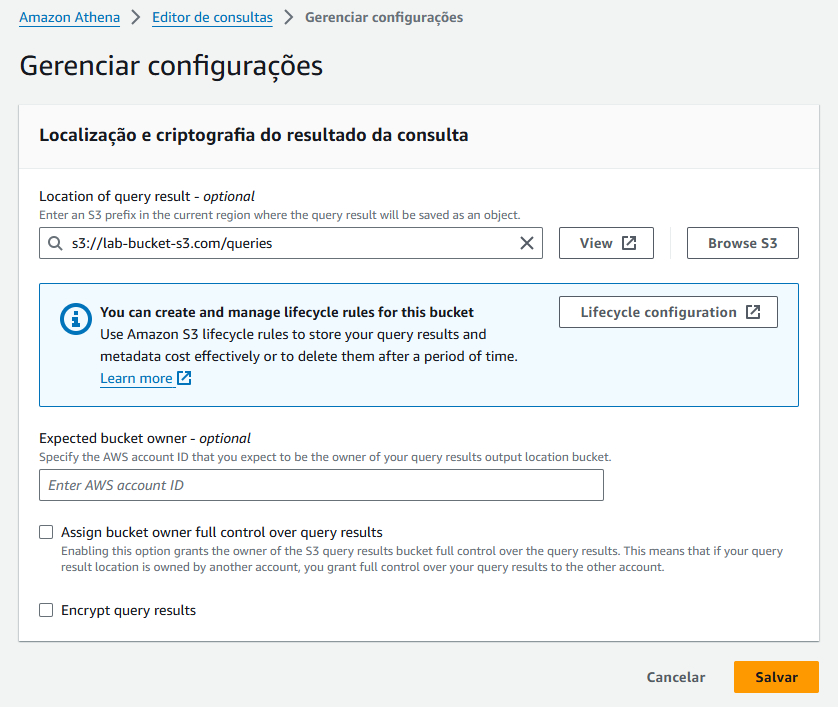
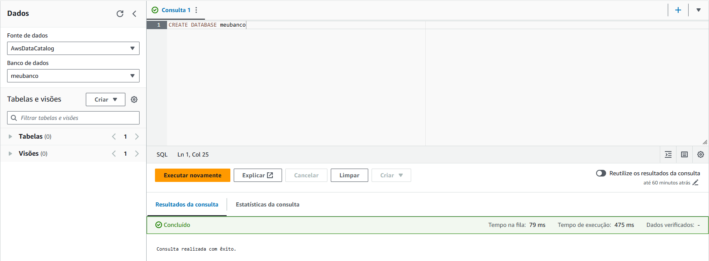
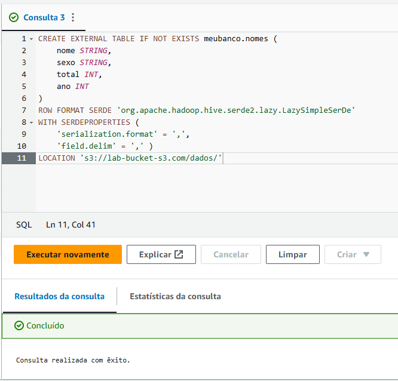
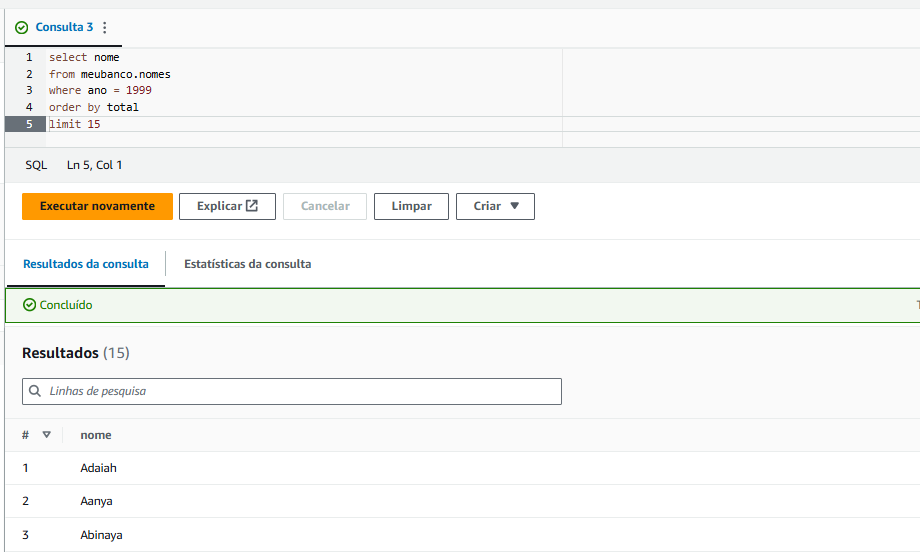
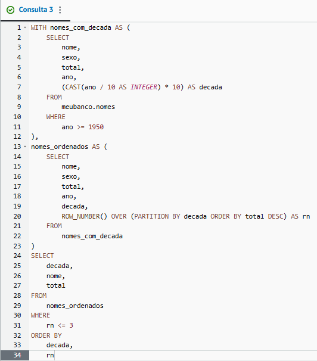
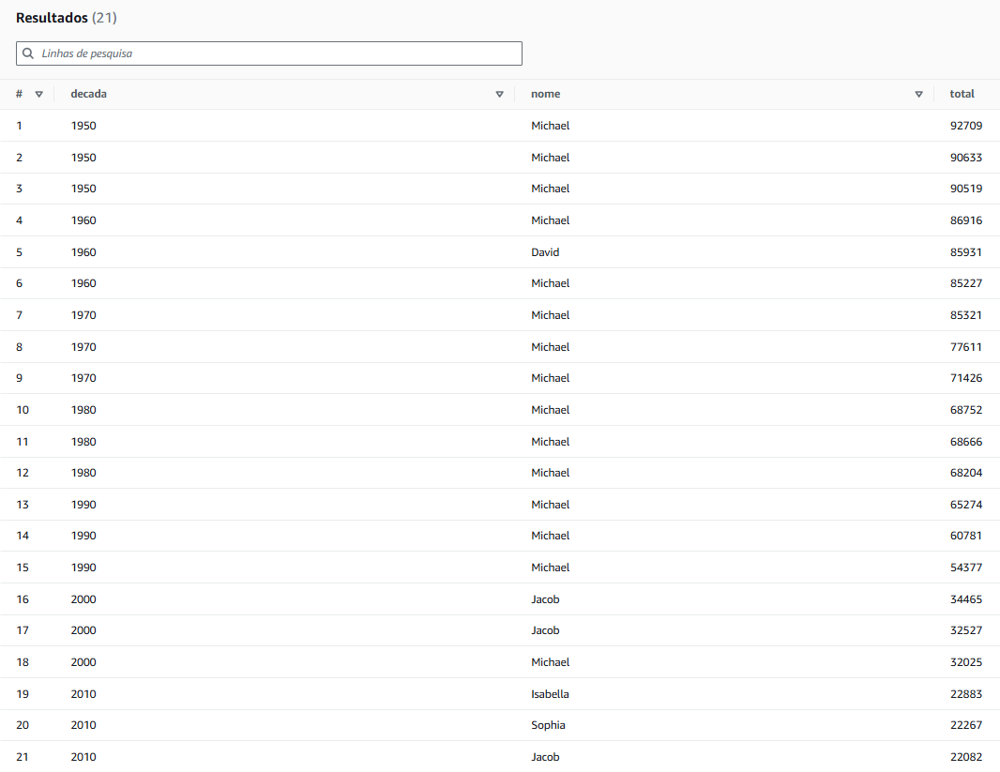

## 2. Lab AWS Athena  
**Etapa 1 - Configurar *AWS Athena*:**  


**Etapa 2 - Criar um banco de dados:**  


**Etapa 3 - Criar uma tabela:**  
* Criando tabela:  


* Realizando *query* de teste:  


* *Script* da *query* que lista os 3 nomes mais usados em cada década desde 1950 até hoje:  


* *Output* da *query* anterior:  


* **Script para conferência:**  
```SQL
WITH nomes_com_decada AS (
    SELECT
        nome,
        sexo,
        total,
        ano,
        (CAST(ano / 10 AS INTEGER) * 10) AS decada
    FROM
        meubanco.nomes
    WHERE
        ano >= 1950
),
nomes_ordenados AS (
    SELECT
        nome,
        sexo,
        total,
        ano,
        decada,
        ROW_NUMBER() OVER (PARTITION BY decada ORDER BY total DESC) AS rn
    FROM
        nomes_com_decada
)
SELECT
    decada,
    nome,
    total
FROM
    nomes_ordenados
WHERE
    rn <= 3
ORDER BY
    decada,
    rn
```
  