## 3. Lab AWS Lambda
**Etapa 1 - Criar a função do *Lambda*:**  
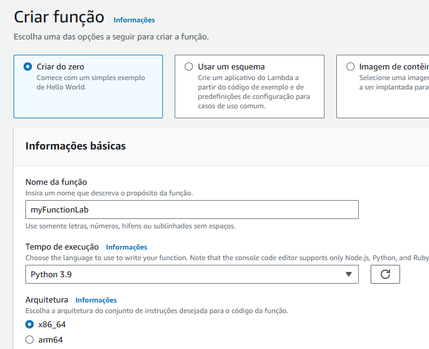

**Etapa 2 - Construir o código:**
* *Deploy* no *script lambda_function.py*:  
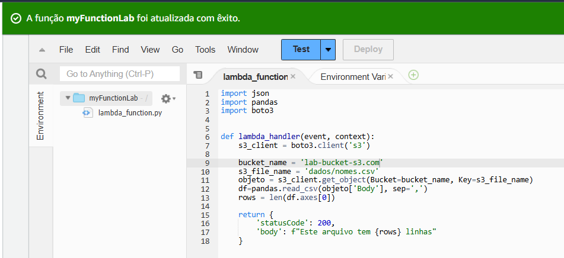  

* Erro de teste:  
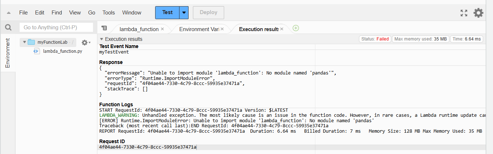  

**Etapa 3 - Criar uma *layer*:**  
* *Build* do *Dockerfile*:  
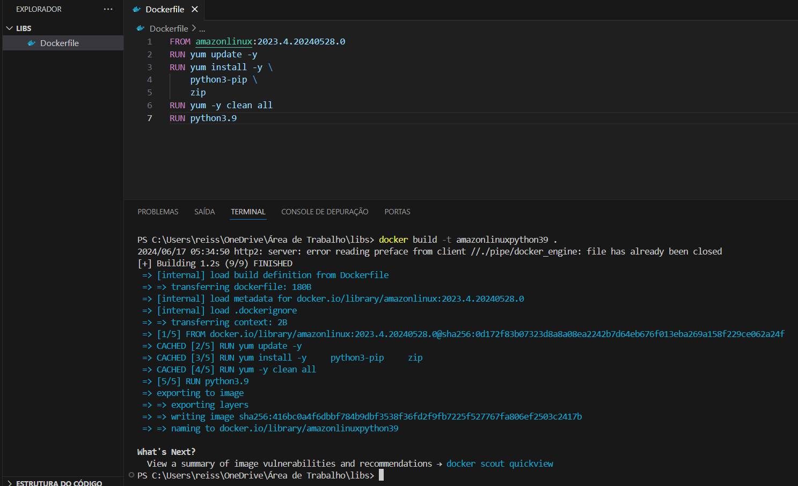  

* ***Script* do *Dockerfile* para conferência:**
```Dockerfile
# Versão do Amazon Linux e Python foram alteradas por motivos de incompatibilidade. Comando 'pip install --upgrade pip' foi removido por ser inconsistente com o script deste Dockerfile.

FROM amazonlinux:2023.4.20240528.0
RUN yum update -y
RUN yum install -y \
    python3-pip \
    zip 
RUN yum -y clean all
RUN python3.9
```
* Rodando *container*, instalando o *Pandas* e compactando pasta:  
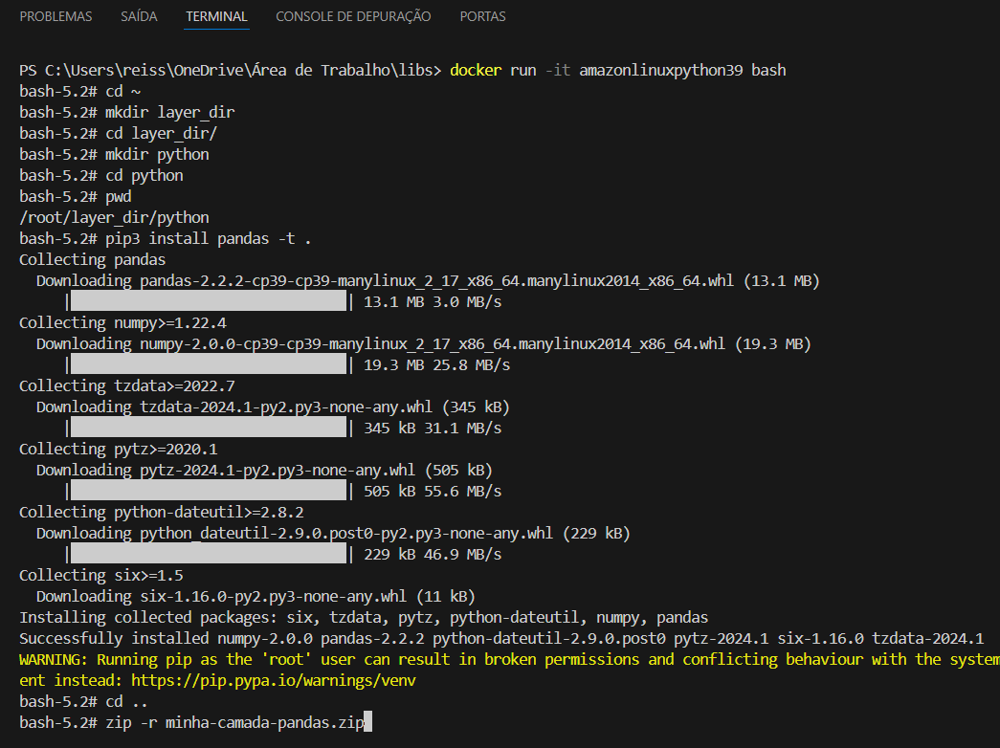  

* Copiando o *.zip* do *container* para a máquina local:  
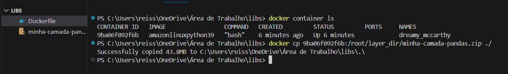  

* *Upload* do *layer* em um *bucket* no S3:  
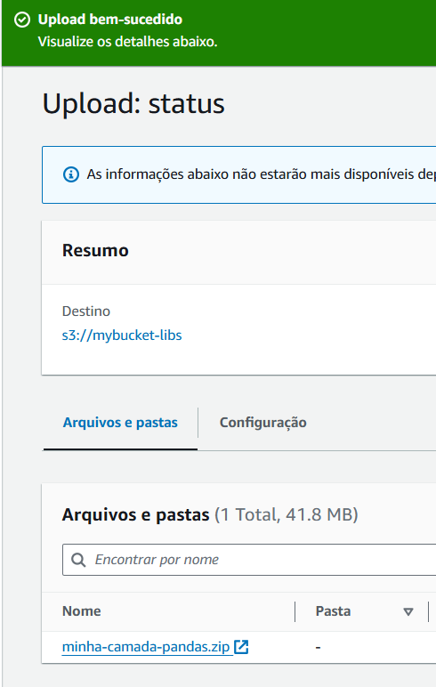  

* Criando camada:  
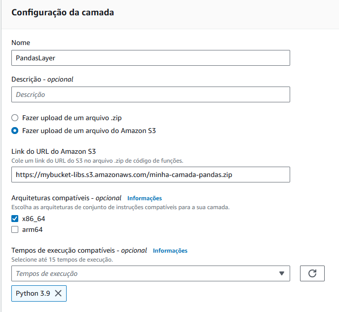  

**Etapa 4 - Utilizando a *layer*:**
* Adicionando *layer* à função *Lambda*:  
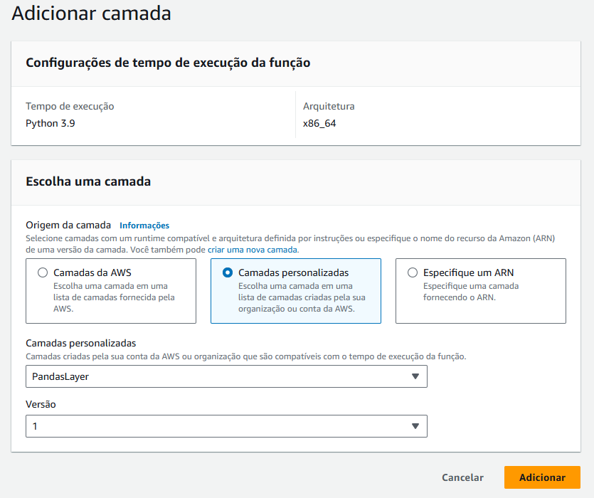  

* Configurando memória/tempo limite de execução do *script*:  
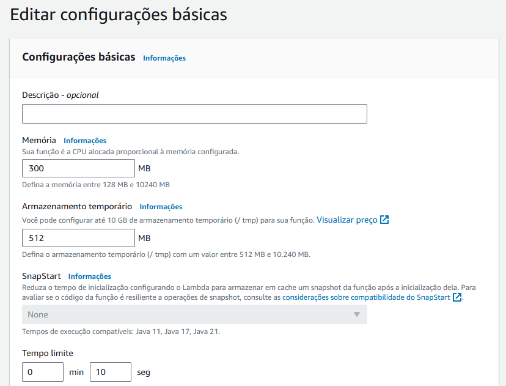  

* Execução final do *Lambda*:  
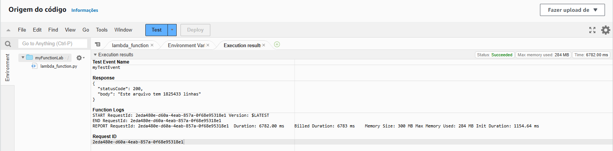  

**Limpeza de recursos utilizados nos *labs*:**  
  
 