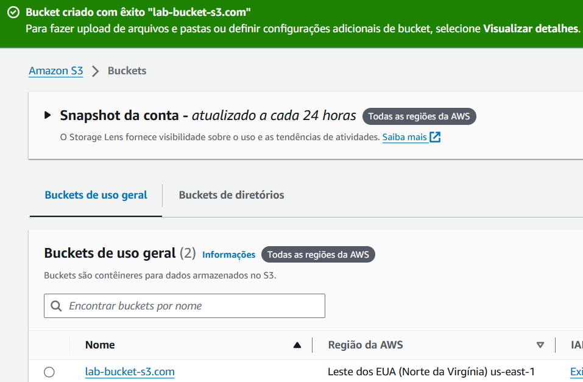
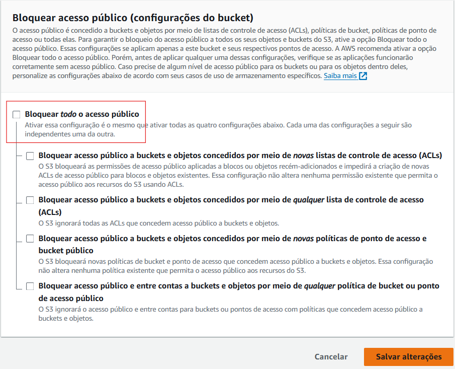

## 1. Lab AWS S3 
**Etapa 1 - Criar um *bucket*:**  
 

**Etapa 2 - Habilitar hospedagem de *site* estático:**  
 

**Etapa 3 - Editar as configurações do bloqueio de acesso público:**  

**Etapa 4 - Adicionar política de *bucket* que torna o conteúdo do *bucket* publicamente disponível:**  

**Etapa 5 - Configurar um documento de índice:**  

**Etapa 6 - Configurar documento de erros:**  

**Etapa 7 - Testar *endpoint* do *site*:**  

