# Desafio de Filmes e Séries - Entrega 2
## Instruções  
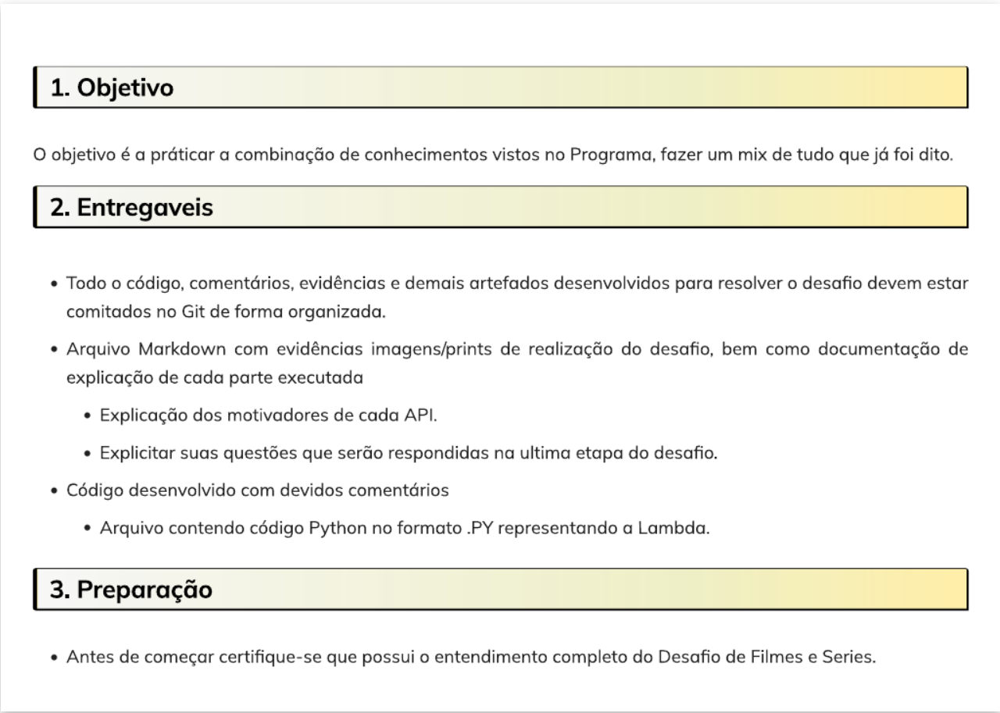 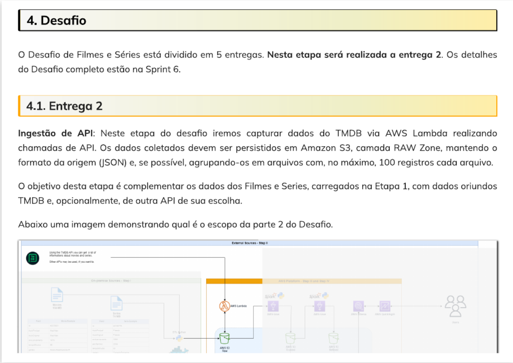  
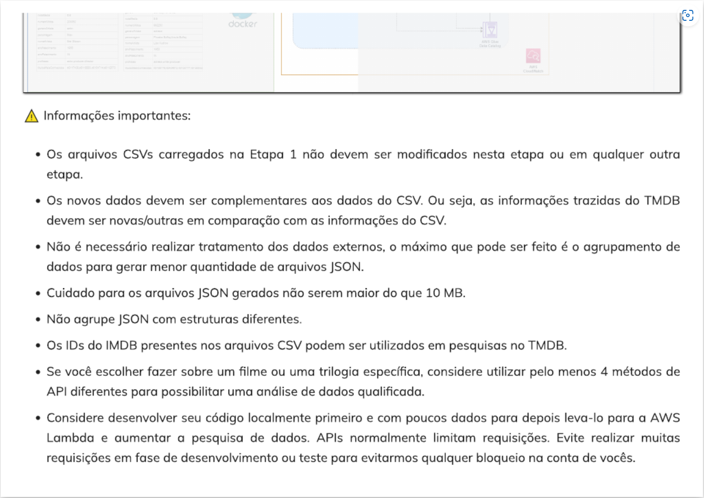 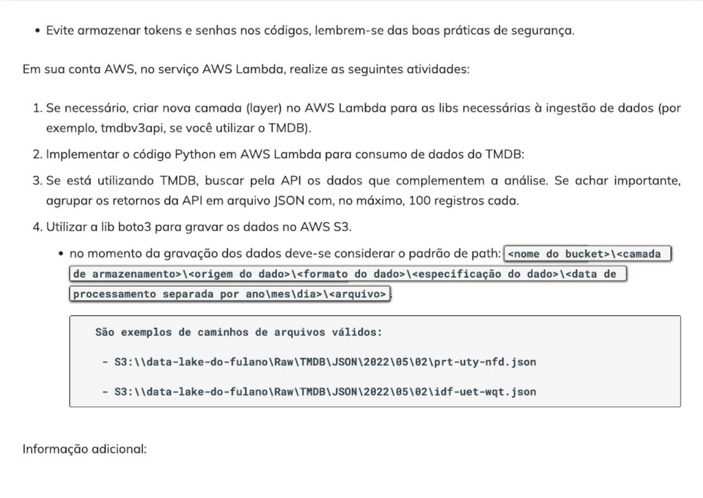  
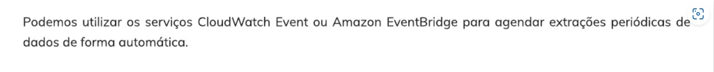  

## Atualização da análise  
Visando um projeto de análise de dados mais assertivo, pretendo responder, ao final do projeto, apenas perguntas relacionadas aos dados dos filmes de dois gêneros ou mais que sejam pelo menos dos gêneros sci-fi e fantasia. Para a entrega 2 do desafio, minha ideia é utilizar os campos "popularity", "vote_average", "vote_count" e "release_date" da API para fazer análises em função de outros campos do CSV para responder algumas perguntas como:  
  
* Quais são os filmes sci-fi e fantasia mais populares por ano de lançamento?  
* Qual a relação entre a popularidade de um filme e sua nota?  
* Qual a média das notas dos filmes com maior taxa de popularidade?  
* Qual a média de votos dos filmes mais mal avaliados?  
  
Estas e outras perguntas serão feitas para que na entrega dos Dashboards ao final do projeto, seja possível analisar, em função de alguns parâmetros, indicadores de como estes filmes são recebidos pelo público e pela crítica ao longo do tempo.

## Explicando o código desenvolvido
### API
Como dito anteriormente, o motivo principal do uso dos dados da API é pra complementar alguns dados relacionados a popularidade dos filmes, filtrando apenas pelos filmes que sejam pelo menos dos gêneros sci-fi e fantasia. Para isso, utilizei a API do TMDB (tmdbv3api) e o método Discover (discover_movies) com alguns parâmetros para filtrar os resultados, como ``genres = "14,878"`` (pelo menos sci-fi e fantasia), ``include_adult = True`` (inclui filmes adultos) e ``sort_by = "popularity.desc"`` (ordenado pela popularidade). Outro parâmetro utilizado é o ``page``. Este parâmetro indica qual página será retornada da API. Cada página retorna 20 objetos JSON. Utilizando a lib OS, o código foi desenvolvido de forma que o arquivo JSON com os dados dos filmes seja agrupado a cada 5 requests (100 objetos).
  
### Lib os  
A lib OS foi utilizada para sequenciar os requests a cada execução do script. A primeira execução cria um arquivo JSON contendo informações do índice e da última página processada e é atualizada a cada nova execução. Esse arquivo é utilizado no script para processar as próximas páginas (de 5 em 5, até a última página, de número 100) do request e salvar o índice que será utilizado nos arquivos JSON de dados gerados (Ex.: dados_1.json, dados_2.json, dados_3.json...). Desta forma, o código está apto para futuramente ser utilizado em conjunto com o Amazon EventBridge, já que será possível executá-lo mais de uma vez para retornar os próximos resultados.  
  
### Lib json
Utilizada para transformar o resultado do request em JSON e descarregar em novos arquivos JSON.  
  
### Lib boto3
Lib utilizada para efetuar o upload dos dados no bucket do S3.  
  
### Lib datetime
Utilizada para extrair a data de execução do script no path do S3.

## Script utilizado no Lambda:
```Python
from tmdbv3api import TMDb, Discover
import json
import os
import boto3
from datetime import datetime

# Configuração da API TMDb
tmdb = TMDb()
tmdb.api_key = "b264a841f0419dd0a6c3f408778df9ba"
tmdb.language = 'en'

discover = Discover()

# Parâmetros
genres = "14,878"
include_adult = True
sort_by = "popularity.desc"

# Diretório local para armazenar temporariamente os arquivos JSON e estado
local_dir = "/tmp/tmdb_data"  # Diretório temporário no Lambda
os.makedirs(local_dir, exist_ok=True)

# Configuração do cliente S3
s3 = boto3.client('s3')
bucket = 'data-lake-danilo'

# Arquivo para armazenar o estado da última página processada
state_file = os.path.join(local_dir, "state.json")

# Função para carregar o estado atual
def load_state():
    if os.path.exists(state_file):
        with open(state_file, "r") as file:
            return json.load(file)
    return {"last_page": 0, "file_index": 1}

# Função para salvar o estado atual
def save_state(state):
    with open(state_file, "w") as file:
        json.dump(state, file)
    upload_to_s3(state_file, f'/Raw/TMDB/JSON/{datetime.now().strftime("%Y/%m/%d")}/state.json')

# Função para descobrir filmes
def discover_movies(page):
    result_list = []
    resultados = discover.discover_movies({
        "page": page,
        "sort_by": sort_by,
        "with_genres": genres,
        "include_adult": include_adult
    })

    for resultado in resultados:
        result_list.append(resultado._json)

    return result_list

# Função para salvar resultados em arquivo JSON
def save_to_json(result_list, file_index):
    output_file = os.path.join(local_dir, f"data_{file_index}.json")
    with open(output_file, "w", encoding="utf-8") as json_file:
        json.dump(result_list, json_file, ensure_ascii=False, indent=4)
    print(f"Dados dos filmes salvos em {output_file}")
    upload_to_s3(output_file, f'/Raw/TMDB/JSON/{datetime.now().strftime("%Y/%m/%d")}/data_{file_index}.json')

# Função para fazer upload dos arquivos para o S3
def upload_to_s3(local_file, s3_file):
    s3.upload_file(local_file, bucket, s3_file)
    print(f"Carregado com sucesso: {local_file} para s3://{bucket}/{s3_file}")

# Função principal para automatizar o processo
def main(event, context):
    state = load_state()
    current_page = state["last_page"] + 1
    file_index = state["file_index"]

    if current_page > 100:
        print("Todas as páginas foram processadas.")
        return

    result_list = []
    for page in range(current_page, current_page + 5):
        if page > 100:  # Evitar exceder a última página
            break
        resultados = discover_movies(page)
        result_list.extend(resultados)

    if result_list:
        save_to_json(result_list, file_index)
        state["last_page"] = page
        state["file_index"] += 1
        save_state(state)

# Handler do AWS Lambda
def lambda_handler(event, context):
    main(event, context)
    return {
        'statusCode': 200,
        'body': json.dumps('Execução concluída com sucesso!')
    }
```
  
## Evidências 
### Dockerfile
Script do Dockerfile utilizado em um container para instalar as dependências da API do TMDB e utilizá-las futuramente na layer do Lambda:
```Dockerfile
FROM amazonlinux:2023.4.20240528.0
RUN yum update -y
RUN yum install -y \
    python3-pip \
    zip
RUN yum -y clean all
RUN python3.9
```
  
Criando as dependências no Container:  

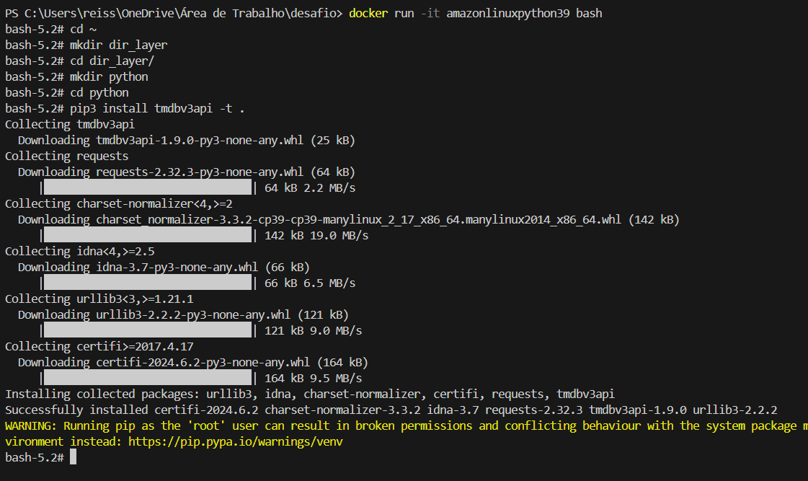  

Zipando o conteúdo e copiando para a máquina host:

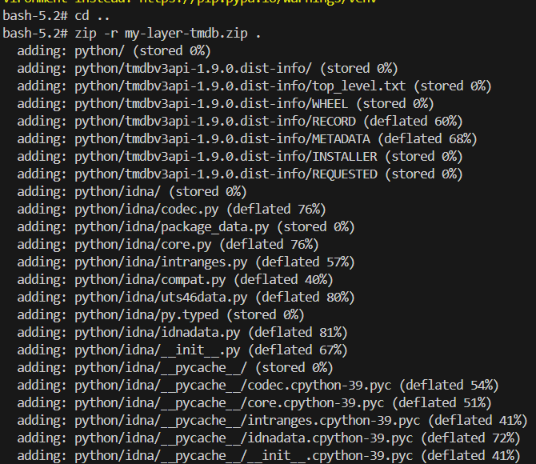  
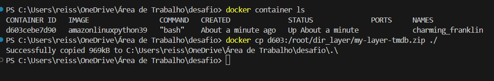

### Console AWS  
Criando uma nova função Lambda:  

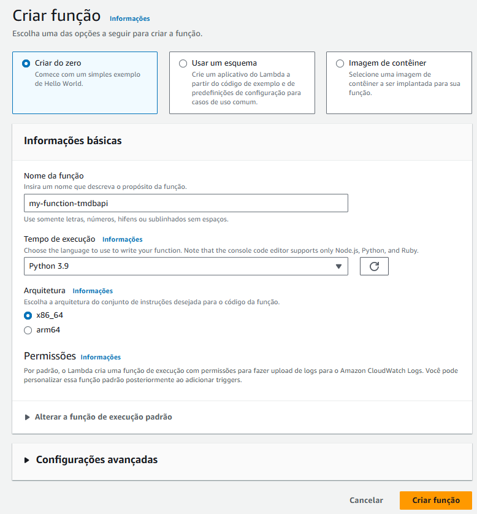  
  
Criando uma nova camada com as dependências do TMDB:  

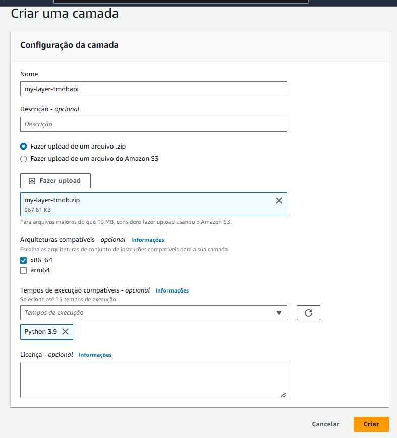  

Anexando uma política de full acess do S3 para a role do Lambda:

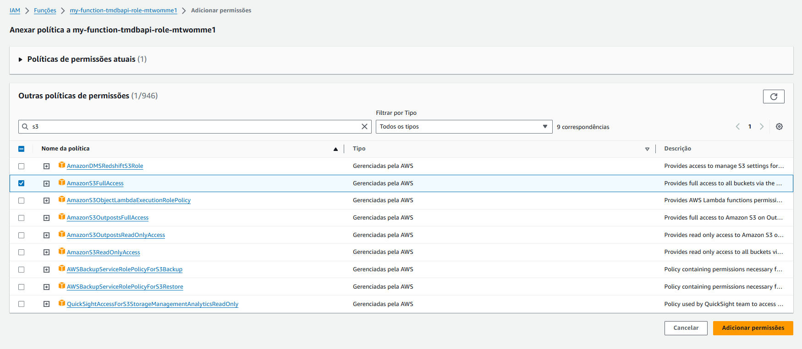  
  
Adicionando a camada à função do Lambda:

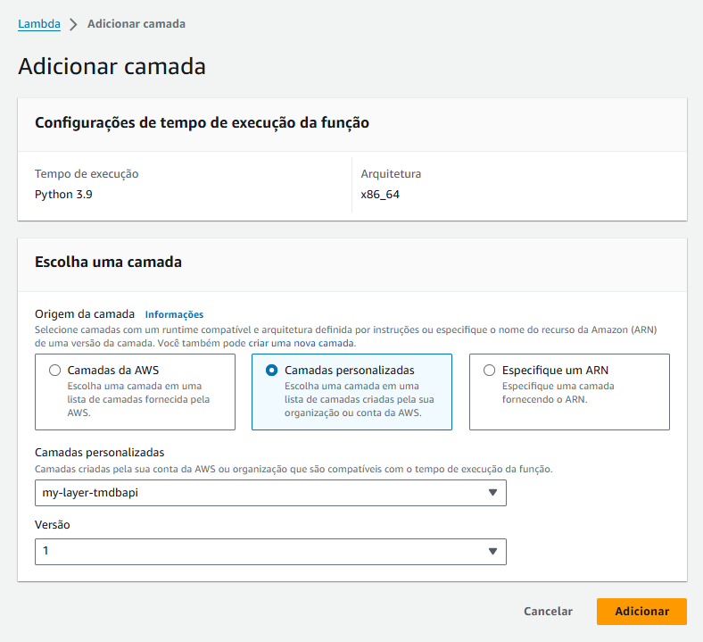

Configurando a função:

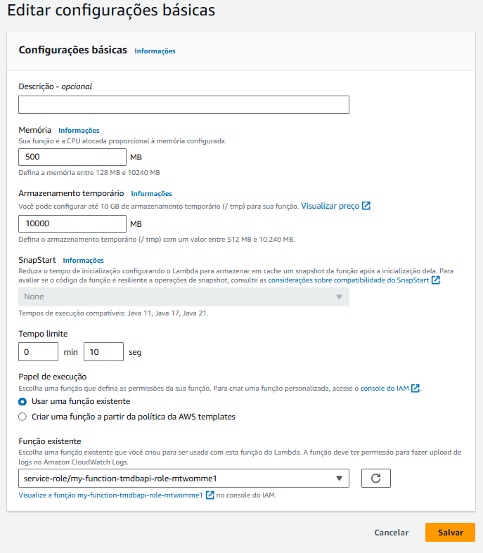

Resultado da execução e evidência da criação dos arquivos no Bucket do S3:

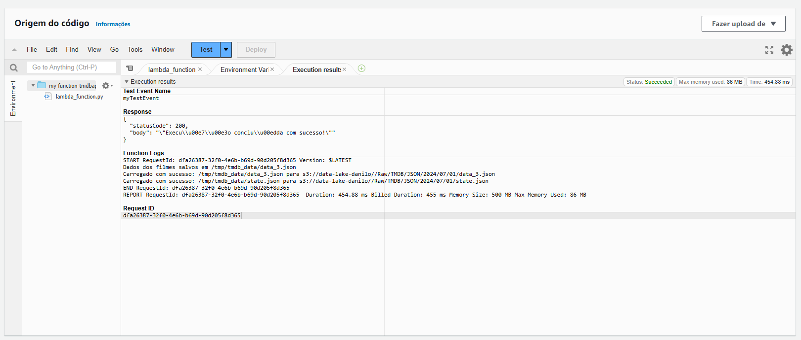
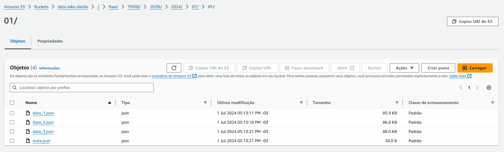

Configuração do Amazon EventBridge:

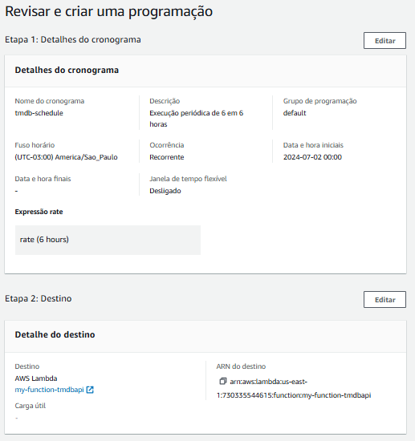
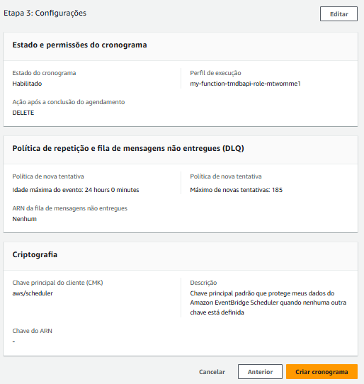
